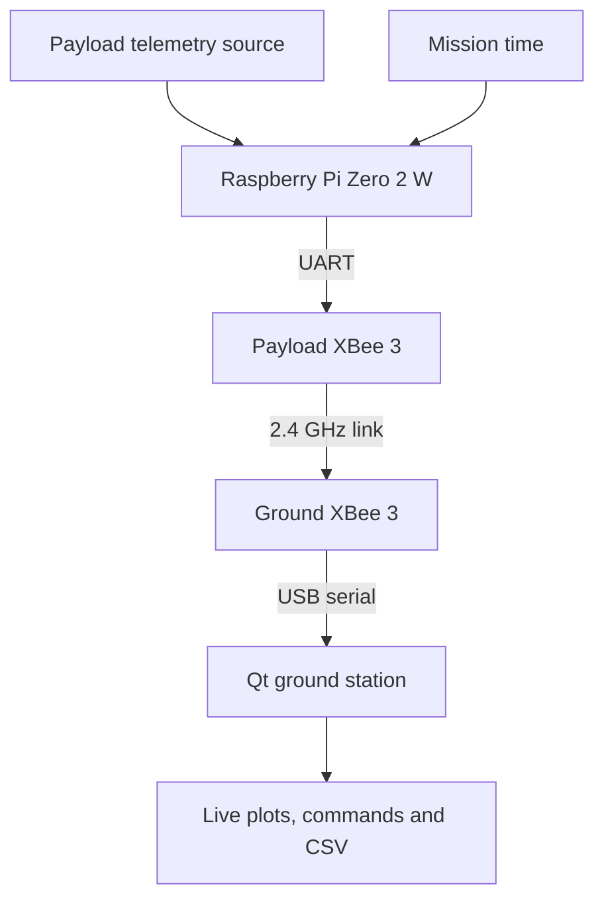
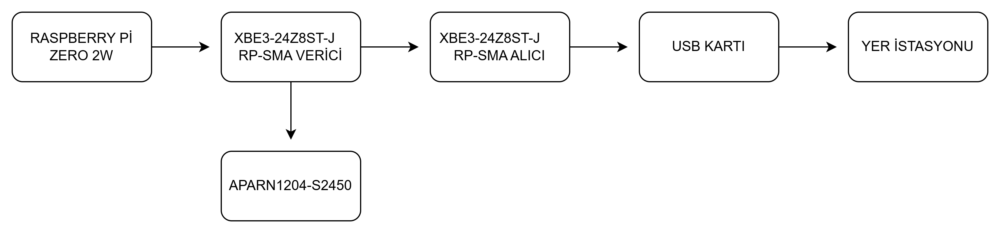
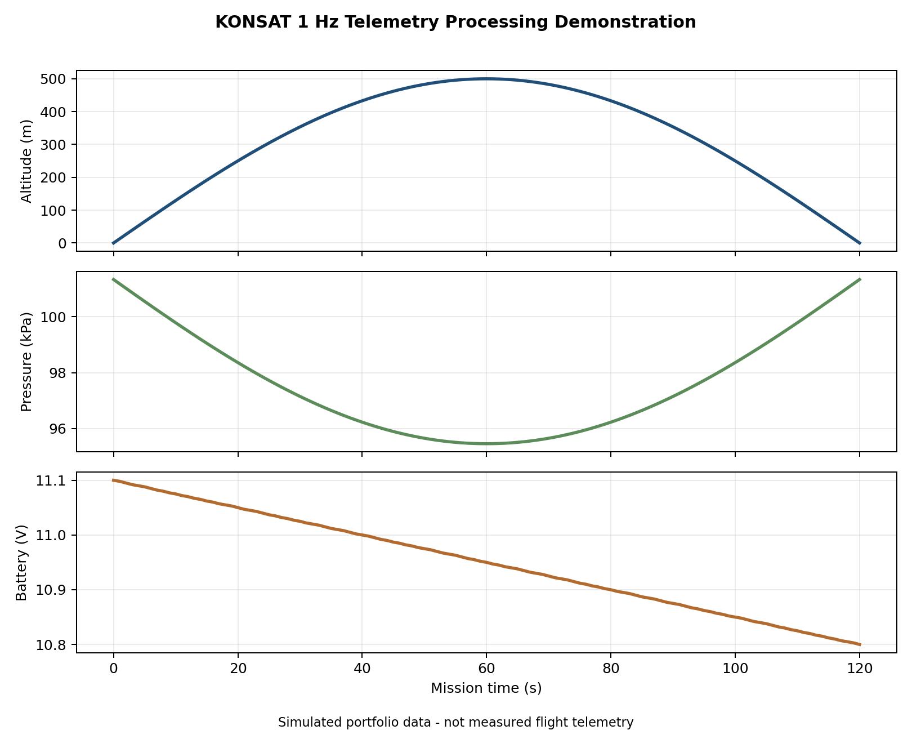

# KONSAT Model Satellite System Design

[](https://github.com/nur1091/konsat-model-satellite-system/actions/workflows/validate.yml)

Systems-engineering portfolio for a 2.4 GHz XBee-based CanSat concept covering telemetry, ground control, electrical interfaces, requirements traceability and reproducible RF link-budget analysis.

## Overview

KONSAT was developed as a 2024-2025 academic model-satellite project and advanced through Preliminary Design Review (PDR) and Critical Design Review (CDR). This portfolio is deliberately limited to my assigned communication, ground-station and electrical-interface work.

This repository converts the surviving design-review material into a concise and reviewable engineering portfolio. It intentionally separates documented design evidence from planned verification work.

| Project snapshot | Scope |
|---|---|
| Lifecycle | Preliminary and Critical Design Reviews |
| Individual responsibility | Communication, ground station and electrical-system interfaces |
| Core evidence | CDR communication diagram, requirements traceability and RF analysis |
| Demonstrator | Reconstructed 1 Hz telemetry generation, CSV logging and visualization |
| Validation status | Design and analysis evidence; no flight-test claim |

## My contribution

As the team member responsible for the **communication system, ground station and electrical systems**, I contributed to:

- The 2.4 GHz XBee telemetry architecture and component trade studies.
- Payload-to-ground-station interfaces and data flow.
- Telemetry-field, command and 1 Hz reporting concepts.
- Ground-station visualization, CSV logging and simulation-mode requirements.
- Electrical distribution and subsystem-interface definition.
- PDR/CDR documentation and requirements-based design reviews.

## Project objectives

- Define a model-satellite architecture traceable to competition requirements.
- Transmit sensor and mission data to a portable ground station at 1 Hz.
- Support command exchange, real-time visualization and CSV recording.
- Select compatible communication, processing and power-interface components.
- Evaluate the line-of-sight RF link with a transparent, reproducible model.
- Establish verification methods before implementation and flight testing.

## System architecture



The architecture is a design baseline, not an as-flown configuration. Hardware-interface risks and unverified assumptions are listed in [System Architecture](docs/system_architecture.md).

## CDR design evidence

The diagram below was extracted as a standalone source image from the supplied CDR presentation. It is limited to my communication responsibility; full-slide screenshots, low-contrast duplicates, unrelated team subsystems and unfinished placeholders are excluded.

### Communication chain



The telemetry-field definitions are preserved separately: [Telemetry fields - part 1](docs/images/original_artifacts/telemetry_fields_1.jpg) and [part 2](docs/images/original_artifacts/telemetry_fields_2.jpg).

## Communication and ground-station interfaces

| Source | Interface | Destination | Engineering purpose |
|---|---|---|---|
| Raspberry Pi Zero 2 W | UART | Payload XBee 3 | Transfer 1 Hz telemetry and receive command data |
| Payload XBee 3 | 2.4 GHz Zigbee radio link | Ground XBee 3 | Bidirectional payload-to-ground communication |
| Ground XBee 3 | USB serial adapter | Ground-station laptop | Deliver packets to the operator application |
| Qt ground-station concept | Serial parser | Live plots and packet counter | Present engineering values and link status |
| Qt ground-station concept | CSV writer | Telemetry archive | Store timestamped packets for post-mission review |

## Electrical interfaces

| Source | Interface | Destination | Status / open item |
|---|---|---|---|
| 3S NCR18650GA battery concept | 10.8 V nominal DC | LM2596 converter | Protection, balancing and fuse design remain open |
| LM2596 converter | Regulated 5 V rail | Raspberry Pi Zero 2 W and communication interfaces | Efficiency, ripple, thermal performance and current margin require measurement |
| Battery-voltage divider | Analog measurement | External ADC / processor interface | ADC hardware must be finalized because Raspberry Pi has no native analog input |
| DS1307 RTC concept | I2C | Raspberry Pi Zero 2 W | Pull-up voltage and 3.3 V compatibility require verification |

## Selected design baseline

| Function | Selected element | Primary interface |
|---|---|---|
| Main processing | Raspberry Pi Zero 2 W | I2C, UART, SPI, USB, CSI |
| Telemetry radio | Digi XBee 3 XB3-24Z8ST-J | UART / 2.4 GHz Zigbee 3.0 |
| Payload antenna concept | Abracon APARN1204-S2450 | 2.4 GHz RF interface |
| Mission time | DS1307 RTC concept | I2C |
| Power conversion | LM2596 buck converter concept | 10.8 V nominal to 5 V |
| Energy storage | Three NCR18650GA cells in series | 3S battery concept |
| Ground software | Qt / C++ concept | USB serial, live plots, CSV |

See [Component Selection](data/component_selection.csv) for the complete design table and known interface risks.

## Reproducible RF analysis

The PDR/CDR material contained a valid 1 km free-space path-loss result but combined it with transmit-power and antenna-gain values that did not match the selected radio and payload antenna. This repository normalizes the calculation to the selected design baseline:

| Parameter | Baseline value |
|---|---:|
| Frequency | 2.4 GHz |
| Distance | 1.0 km |
| XBee transmit power | +8 dBm |
| Payload antenna gain | +2 dBi |
| Ground antenna gain | +17 dBi |
| Free-space path loss | 100.05 dB |
| Predicted received power | -73.05 dBm |
| Receiver sensitivity | -103 dBm |
| Ideal link margin | 29.95 dB |


The result is an **ideal line-of-sight analytical value**. It excludes cable, connector, polarization, pointing, enclosure, multipath and implementation losses because these were not measured. It is not a range-test or flight-test result. See [Methodology and Assumptions](docs/methodology.md).

## Telemetry-processing demonstrator

To make the documented 1 Hz telemetry and CSV-logging concept executable, the repository includes a deterministic portfolio demonstrator. It generates a simulated 120-second mission profile, writes 121 telemetry packets to CSV and produces an operator-style engineering plot.



Review the [telemetry schema](data/telemetry_schema.csv), [sample CSV](data/sample_telemetry.csv) and [demonstrator source](demo/generate_telemetry_demo.py). This is a reconstruction based on my documented interface work; it is not presented as original flight software or measured mission data.

## Requirements and verification

The traceability dataset distinguishes four states:

- `Design evidence`: addressed in the PDR/CDR architecture.
- `Analysis evidence`: supported by a reproducible calculation in this repository.
- `Planned verification`: a test method is defined but no result is available.
- `Open`: the available evidence shows a gap or unresolved interface.

Review the [Requirements Traceability Matrix](data/requirements_traceability.csv) and [Verification Plan](docs/requirements_and_verification.md).

## Repository structure

```text
.github/workflows/   Automated design validation
analysis/            RF calculation and repository checks
demo/                Reconstructed 1 Hz telemetry demonstrator
data/                Inputs, telemetry, component selections and traceability
docs/                Architecture, methodology and design-review notes
  images/original_artifacts/  Standalone source diagrams extracted from the CDR
results/             Generated RF and telemetry summaries
```

The original PDR and CDR files are not redistributed because they contain student identifiers, team information and draft material. Their relevant engineering content is summarized here without presenting the full files as implementation evidence.

## Reproduce the analysis

```bash
python -m pip install -r requirements.txt
python analysis/generate_link_budget.py
python demo/generate_telemetry_demo.py
python analysis/validate_repository.py
```

The GitHub Actions workflow regenerates the RF and simulated telemetry datasets, then checks the committed requirements, component and result files on every push.

## Key engineering findings

- The corrected ideal 1 km link closes analytically with approximately 29.95 dB margin before implementation losses.
- The reconstructed 1 Hz demonstrator produces a traceable telemetry schema, sample CSV and engineering visualization without misrepresenting simulated data as flight evidence.
- The selected XBee variant uses an RPSMA RF port, while the APARN1204-S2450 is a surface-mount patch antenna; the final RF feed and carrier-board implementation therefore remain open.
- The two-hour operating-duration requirement is not verified because a measured load profile and complete power budget are absent.
- The DS1307/Raspberry Pi I2C voltage interface requires hardware-level verification before integration.
- Live telemetry, CSV logging and simulation mode are defined as ground-station requirements but no executable GCS source or test record survives in the supplied files.

## Verification boundary

- Completed: PDR/CDR design definition, component trade studies, interface concept and corrected analytical RF model.
- Not evidenced: assembled flight hardware, environmental qualification, end-to-end telemetry test, measured power endurance or flight validation.
- The repository must therefore be read as a **design and analysis portfolio**, not a flight-qualified CanSat implementation.

## Future work

- Select and validate an antenna/feed implementation compatible with the XBee RPSMA interface.
- Build an end-to-end XBee range-test setup and record RSSI, packet delivery and packet loss.
- Implement the Qt ground station with serial parsing, live plots, commands and CSV logging.
- Complete a measured power budget and a two-hour endurance test.
- Verify I2C voltage compatibility and power-rail current limits.
- Run end-to-end communication and electrical-interface tests against the traceability matrix.

## Tools and technologies

Raspberry Pi Zero 2 W, Digi XBee 3, Zigbee 3.0, UART, I2C, SPI, Qt/C++, Python, telemetry, ground-station design, requirements traceability, PDR/CDR and RF link-budget analysis.

## Author

**Nisanur Kayğusuz**  
Aerospace Engineer  
Necmettin Erbakan University  

[LinkedIn](https://www.linkedin.com/in/nisanur-kay%C4%9Fusuz-62569b1ba/) · [Email](mailto:nisanurkaygusuz0625@gmail.com)
