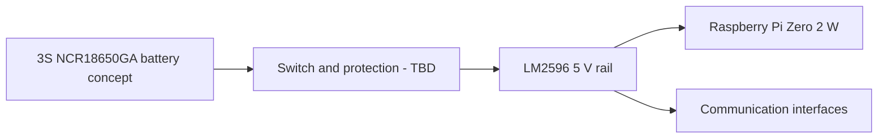

# System Architecture

## Architecture scope

This document is limited to the communication, ground-station and electrical interfaces that formed Nisanur Kayğusuz's assigned responsibility in the available PDR and CDR files.

## Telemetry and command path

The baseline calls for one telemetry packet per second. Intended fields include mission time, altitude, pressure, temperature, battery voltage, command echo, GPS latitude, longitude, altitude and satellite count. The ground-station concept also includes calibration, mechanism commands and simulation-profile playback.

## Communication interface allocation

| Interface | Design allocation |
|---|---|
| UART | Payload XBee telemetry radio |
| USB serial | Ground XBee adapter to Qt ground station |
| I2C | Mission-time RTC interface concept |
| Local storage | Telemetry CSV recording concept |

## Electrical concept

The design-review material proposes three 3.6 V nominal cells in series and an LM2596-based 5 V supply. It does not contain a complete measured load budget, protection design, thermal result or two-hour endurance record.

## Interface risks

1. **RF connector compatibility:** XB3-24Z8ST-J uses an RPSMA antenna connection, while APARN1204-S2450 is a surface-mount patch antenna. A compatible RF feed/carrier solution or a different antenna must be selected.
2. **Analog measurement:** Raspberry Pi Zero 2 W has no native analog input. The battery-voltage divider requires an external ADC or another defined measurement device.
3. **I2C voltage level:** DS1307 modules are commonly associated with a 5 V rail. Pull-up voltage and Raspberry Pi 3.3 V GPIO compatibility must be verified.
4. **Power distribution:** Supplying every peripheral from Raspberry Pi rails requires a verified current budget, start-up analysis and fault isolation.
5. **Ground antenna identity:** The design uses an AS-2-17 17 dBi value, but the exact manufacturer data and connector/polarization details must be confirmed before procurement.

## Evidence boundary

The architecture above is reconstructed from PDR/CDR design evidence. No surviving finalized electrical schematic, wiring harness, executable GCS project or end-to-end communication test record was supplied.
